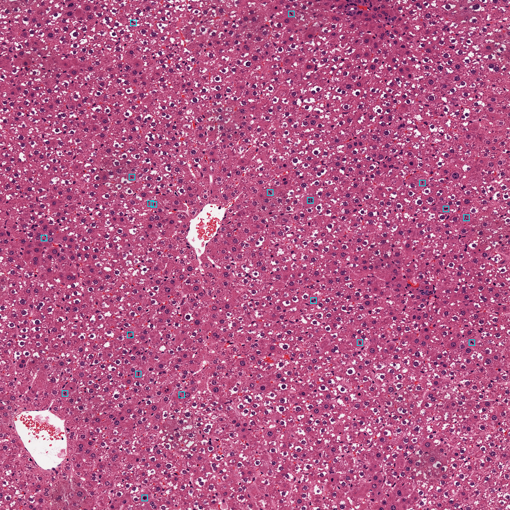

# PathoView Mitosis Detection (PreTox 데모용 추출본)

PathoView 백엔드(`VIENCE-Inc/smart-path-viewer-backend`, `eky15` 브랜치)의
`processing/inference.py` 에서 **mitosis detection 부분만** 추출해 독립 패키지로 정리한 것입니다.
FastAPI / SQLModel / JWT 인증 의존성을 제거했고, **알고리즘은 원본 그대로**입니다.

원본은 한 파일 2,957줄에 HoverNet(핵 분할) · Mitosis(분열상 검출) · SAM3(반자동 어노테이션)
세 기능이 함께 들어 있었고, 그중 mitosis 에 해당하는 약 600줄만 여기 있습니다.

---

## 1. 구성

```
pathoview_mitosis/
├── README.md
├── requirements.txt
├── .gitignore              # git 으로 옮길 때 models/*.onnx 제외 (3장 참고)
├── demo.py                 # CLI 데모 (JSON + 오버레이 PNG 출력)
├── models/
│   └── mitosis_detection_model.onnx   # 동봉된 가중치 74MB (md5 caae3bde…)
├── docs/                   # 환경 대조용 실측 샘플 (2-3장 참고)
│   ├── sample_result.json
│   └── sample_overlay.png
└── mitosis/
    ├── __init__.py         # 공개 API — detect_on_slide(), to_slide_coords()
    ├── config.py           # 모델 경로·추론 파라미터 (전부 env 로 override 가능)
    ├── errors.py           # 예외 정의 (HTTPException 대체)
    ├── session.py          # ONNX 세션 생성·캐싱·GPU OOM 재시도·idle 언로드
    ├── slide.py            # SVS ROI 읽기 (openslide)
    ├── detect.py           # ★ 핵심: 전처리 / 타일 추론 / 박스 정리 / NMS / 후처리
    └── api.py              # 선택적 FastAPI 래퍼 (안 쓰면 fastapi 설치 불필요)
```

**의존 방향:** `detect.py` 가 핵심이고 `config`·`errors` 외에는 아무것도 import 하지 않습니다.
슬라이드를 직접 다루지 않고 numpy 배열만 넘겨 쓸 거라면 `detect.py` + `session.py` 만으로 충분합니다.

---

## 2. 설치

### 2-0. 같은 서버(atlantic)에서 개발한다면 — 설치할 것이 없습니다

GPU 추론까지 검증을 마친 venv 를 공용 위치에 준비해 뒀습니다. 그대로 쓰시면 됩니다.

```bash
/atlantic_data/shj21/ABMIL/PreTox/mitosis-venv/bin/python demo.py --slide ... 
```

- 시스템 python 3.12.3 기반이라 **다른 계정에서도 그대로 실행됩니다** (전 경로 read/execute 개방).
- `onnxruntime-gpu` + cuDNN 9 까지 들어 있어 2-1 의 함정을 겪지 않습니다.
- 직접 만들고 싶으면 아래 2-1 부터 보시면 됩니다.

### 2-1. 새로 설치하는 경우

```bash
pip install -r requirements.txt
```

> ⚠️ **`onnxruntime` 은 원본 PathoView 의 `requirements.txt` 와 `Dockerfile` 어디에도 없습니다.**
> 배포 이미지에 수동 설치된 것으로 보입니다. GPU 를 쓰려면 `onnxruntime-gpu` 를 직접 설치해야 하며,
> 원본 베이스 이미지가 `pytorch/pytorch:2.5.0-cuda12.4-cudnn9-runtime` 이므로 CUDA 12 빌드를 쓰면 됩니다.

### 2-2. GPU 를 쓸 때 반드시 알아야 할 함정 — CPU 로 조용히 폴백됩니다

`onnxruntime-gpu` 는 **CUDA/cuDNN 라이브러리를 함께 설치해 주지 않습니다.** 호스트에 cuDNN 9 가
없으면 `CUDAExecutionProvider` 생성이 실패하는데, [session.py:76](mitosis/session.py#L76) 이 provider 목록
끝에 항상 `CPUExecutionProvider` 를 붙이기 때문에 **에러 없이 CPU 로 떨어져 계속 동작합니다.**
아래는 실제로 겪은 로그입니다.

```
Failed to load library libonnxruntime_providers_cuda.so with error:
  libcudnn.so.9: cannot open shared object file: No such file or directory
...
active_providers ['CPUExecutionProvider']      ← GPU 로 착각하기 쉬운 지점
```

해결은 cuDNN 9 휠을 같이 설치하는 것뿐입니다 (`requirements.txt` 에 포함해 뒀습니다).
`session.py` 의 `ort.preload_dlls()` 가 site-packages 에서 자동으로 찾으므로
`LD_LIBRARY_PATH` 를 건드릴 필요는 없습니다.

```bash
pip install "nvidia-cudnn-cu12>=9,<10" nvidia-cublas-cu12
```

**기동 시 반드시 `active_providers` 로그를 확인하세요.** `['CUDAExecutionProvider', ...]` 여야
정상이고, `['CPUExecutionProvider']` 만 찍히면 GPU 를 못 쓰고 있는 것입니다 (아래 실측 18배 차이).
CPU 폴백을 아예 에러로 만들려면 환경변수 `ORT_REQUIRE_GPU=1` 을 주면 됩니다
([session.py:119](mitosis/session.py#L119) 에서 검사하며, GPU provider 가 활성이 아니면 `RuntimeError`).

### 2-3. 실측 검증 결과 (2026-08-14)

실제 WSI 로 **엔드투엔드 추론까지 확인했습니다.** 상대 환경에서 나온 결과를 대조하는 기준으로
쓰시면 됩니다.

```
슬라이드 : 41821.svs (69719 × 32487, level-0)
ROI      : x=20000 y=20000 2048×2048,  tile 512 / overlap 32 / score 0.4 / NMS IoU 0.3
결과     : raw 25건 → NMS 후 19건,  최고 score 0.900
```

| | 소요 시간 | active_providers |
|---|---|---|
| GPU (RTX 6000 Ada) | **2.21s** | `['CUDAExecutionProvider', 'CPUExecutionProvider']` |
| CPU 폴백 | 39.73s | `['CPUExecutionProvider']` |

> 위 시간은 **모델이 이미 올라온 상태**의 값입니다. `demo.py` 를 처음 실행하면 CUDA 컨텍스트
> 초기화 + 모델 로드가 포함되어 **6~7초**가 찍힙니다(정상). 같은 프로세스에서 두 번째 ROI 부터는
> 약 0.8초입니다. 서버로 띄울 때는 기동 직후 워밍업 추론을 한 번 돌려두는 것을 권합니다.

CPU 와 GPU 의 검출 결과는 개수·라벨·좌표가 동일했습니다 (박스 한 곳에서 0.1px 수준의 부동소수점
차이만 발생). 오버레이 PNG 상에서 검출 박스는 개별 핵 위에 정확히 위치했습니다.

**대조용 샘플을 동봉했습니다.** 같은 명령을 돌려서 아래와 결과가 일치하면 환경이 정상입니다.

```
docs/sample_result.json    위 조건으로 나온 검출 19건 (전체 좌표·score·label)
docs/sample_overlay.png    오버레이 이미지 (2048 → 1024 축소본)

# 재현 명령
/atlantic_data/shj21/ABMIL/PreTox/mitosis-venv/bin/python demo.py \
  --slide /atlantic_data/shj21/ABMIL/PreTox/mitosis_detection/wsi/41821.svs \
  --x 20000 --y 20000 --width 2048 --height 2048 --out-json /tmp/mine.json

# 비교
diff <(python3 -m json.tool /tmp/mine.json) <(python3 -m json.tool docs/sample_result.json)
```



> 참고: GPU 세션 생성 시 `24 Memcpy nodes are added to the graph` 경고가 뜨는데, 모델 그래프에
> CUDA 미지원 op 이 섞여 있어 생기는 정상 동작입니다. 무시해도 됩니다.

## 3. 모델 가중치

**이 패키지에 동봉되어 있습니다.** 별도로 받을 필요 없이 `models/` 아래에 있습니다.

```
models/mitosis_detection_model.onnx
  크기 : 74,467,955 B (74MB)
  md5  : caae3bdeb561092e7738cf314dab8c14
```

받으신 뒤 아래로 무결성을 확인해 주세요 (전송 중 손상 여부 확인용):

```bash
md5sum models/mitosis_detection_model.onnx
# caae3bdeb561092e7738cf314dab8c14 이어야 합니다
```

경로 탐색 순서는 `mitosis/config.py` 에서 다음과 같습니다. **보통은 아무것도 설정할 필요가
없습니다** — 동봉본이 자동으로 잡힙니다.

1. `MITOSIS_MODEL_PATH` 환경변수
2. 동봉본 `<패키지루트>/models/mitosis_detection_model.onnx`
3. `/workspace/models/mitosis_detection_model.onnx` — 원본 PathoView 의 배포 레이아웃

원본 코드는 3번을 **하드코딩**하고 있었고 (HoverNet 과 달리 env override 가 없었습니다),
다른 위치에 두려면 아래처럼 지정하면 됩니다.

```bash
export MITOSIS_MODEL_PATH=/path/to/mitosis_detection_model.onnx
```

> **git 으로 전달하는 경우** — 74MB 바이너리를 커밋하지 않도록 동봉된 `.gitignore` 가
> `models/*.onnx` 를 제외합니다. 이 경우 가중치 파일은 별도 채널로 전달해야 합니다
> (74MB 라 메일 첨부는 대개 불가, 사내 드라이브나 Slack 을 쓰시면 됩니다).

<details>
<summary>가중치 출처 및 재생성 방법</summary>

사내 서버에서 확인된 원본 위치 (2026-08 기준, 세 곳 모두 md5 동일):

```
/atlantic_data/shj21/CANVAS/meta/AI_examples/Mitosis_Detection/modules/mitosis/
/atlantic_data/cluster-a1/meta/AI_examples/Mitosis_Detection/modules/mitosis/
/atlantic_data/kumc-server2/backend/computing_server/ai_training/examples/Mitosis_Detection/modules/mitosis/
```

모델은 **FCOS (ResNet-18 백본)** 객체 검출기이며, 위 경로에 학습 체크포인트
`checkpoints/FCOS_18.ckpt` 와 변환 스크립트 `export_onnx.py`, 설정 `configs/FCOS_18.yaml`
이 함께 있습니다. onnx 가 유실되어도 재생성할 수 있습니다.

ONNX 그래프 시그니처 (이 패키지의 `detect.py` 가 기대하는 형태):

| | 이름 | 형태 |
|---|---|---|
| 입력 | `images` | 공간 차원 동적 (`height`, `width`) |
| 출력 | `boxes` / `scores` / `labels` | 검출 수 동적 (`num_boxes`) |

</details>

---

## 4. 사용법

### 4-1. 파이썬에서 직접

```python
from mitosis import PixelRect, detect_on_slide

result = detect_on_slide(
    "/path/to/slide.svs",
    PixelRect(x=20000, y=20000, width=2048, height=2048),
    model_path="/path/to/mitosis_detection_model.onnx",
    score_threshold=0.4,
)

print(result["processedResults"]["summary"])
# {'totalDetections': 137, 'keptDetections': 12, 'scoreThreshold': 0.4,
#  'usedTiling': True, 'tileSize': 512, 'tileOverlap': 32}

for det in result["processedResults"]["detections"]:
    print(det["box"], det["score"], det["label"])
    # {'x1': 512.3, 'y1': 88.1, 'x2': 547.9, 'y2': 124.6} 0.87 1
```

**ROI 여러 개를 연속 처리할 때는 세션을 재사용하세요** (매번 모델을 다시 올리지 않도록):

```python
from mitosis import get_mitosis_session, read_svs_region_rgb, run_mitosis_on_region

session = get_mitosis_session("/path/to/model.onnx")   # 최초 1회만 로드, 이후 캐시 재사용
for rect in rects:
    region = read_svs_region_rgb(svs_path, rect)
    result = run_mitosis_on_region(region, session)
```

### 4-2. CLI 데모

```bash
# 슬라이드 크기 먼저 확인 (ROI 좌표 잡기용)
python demo.py --slide /path/to/slide.svs --info

# 검출 + JSON + 오버레이 PNG
# --model 을 생략하면 동봉된 models/mitosis_detection_model.onnx 를 씁니다 (3장 참고)
python demo.py \
  --slide /path/to/slide.svs \
  --x 20000 --y 20000 --width 2048 --height 2048 \
  --out-json result.json --out-png overlay.png
```

### 4-3. FastAPI 래퍼 (선택)

```bash
pip install fastapi uvicorn pydantic
export SLIDE_ROOT=/data
export MITOSIS_MODEL_PATH=/path/to/model.onnx
uvicorn mitosis.api:app --host 0.0.0.0 --port 8000
```

```bash
curl -X POST localhost:8000/inference/mitosis_detection -H 'Content-Type: application/json' -d '{
  "slide_path": "case01/41821.svs",
  "region": {"x": 20000, "y": 20000, "width": 2048, "height": 2048},
  "score_threshold": 0.4
}'
```

---

## 5. 동작 방식

```
detect_on_slide(svs_path, rect)
  ├── get_mitosis_session()        ONNX 세션 (캐시 재사용, GPU OOM 시 다른 모델 언로드 후 1회 재시도)
  ├── read_svs_region_rgb()        openslide 로 level-0 ROI 를 (H,W,3) uint8 로 읽음
  └── run_mitosis_on_region()
       ├── choose_default_mitosis_tile_size()  요청값 > env > 모델 static shape > 1024
       ├── get_tile_starts()                   겹치는 타일 좌표 (마지막 타일은 끝에 정렬)
       ├── infer_mitosis_tile()   ← 타일마다   리사이즈 → /255 정규화 → NCHW → session.run
       │     └── 타일 로컬 좌표 → ROI 좌표로 오프셋 보정
       └── post_process_mitosis()              score 컷 → class-aware NMS → detections
```

**모델 출력 자동 인식.** `choose_detection_outputs()` 가 출력 이름(`boxes`/`scores`/`labels` 및
동의어)으로 먼저 찾고, 실패하면 shape·dtype 으로 추정합니다 (Nx4 float → boxes 등).
따라서 모델을 교체해도 출력 이름이 달라지는 정도는 코드 수정 없이 흡수됩니다.

**박스 좌표 자동 환산.** 좌표 최대값이 1.5 이하면 0~1 정규화 출력으로 보고 픽셀로 환산합니다
(`maybe_denormalize_boxes`).

---

## 6. ⚠️ 좌표계 주의

`detections[i]["box"]` 좌표는 **ROI 로컬 픽셀**입니다 (ROI 좌상단이 원점).
원본 PathoView 에서는 프론트엔드가 ROI 원점을 알고 있어 클라이언트에서 더했습니다.
서버 쪽에서 슬라이드 전역 좌표가 필요하면:

```python
from mitosis import to_slide_coords
result = to_slide_coords(result, rect)   # 전역 좌표 사본 반환
```

---

## 7. 원본에서 바뀐 점

| 항목 | 원본 PathoView | 이 패키지 |
|---|---|---|
| 검출 알고리즘 | — | **동일** (전처리·타일링·NMS·후처리 전부 그대로) |
| 모델 경로 | `/workspace/models/...` 하드코딩 | `MITOSIS_MODEL_PATH` env / 인자로 지정 |
| 추론 파라미터 | `run_mitosis_detection()` 내부에 하드코딩. 요청 스키마의 해당 필드는 **전부 주석 처리**되어 조정 불가 | `config.py` 상수 + 함수 인자 + API 요청 필드로 노출. 기본값은 원본과 동일 |
| 슬라이드 경로 해석 | `case_id`/`filename` → DB(`get_my_data_location`) | `SLIDE_ROOT` 기준 상대 경로 (경로 탈출 차단 포함) |
| 예외 | 코어 깊은 곳에서 `HTTPException` 직접 raise | `errors.py` 의 일반 예외. HTTP 매핑은 `api.py` 에서만 |
| `PixelRect` | pydantic `BaseModel` | dataclass (코어에서 pydantic 제거). API 스키마는 `api.py` 가 별도 정의 |
| 인증 | JWT (`auth_processing.authenticate`) | **없음** — 데모용. 외부 노출 시 반드시 추가할 것 |
| 전역 좌표 변환 | 없음 (프론트 담당) | `to_slide_coords()` 추가 |

**기본 파라미터 (원본 `run_mitosis_detection()` 과 동일):**
`score_threshold=0.4`, `tile_size=512`, `tile_overlap=32`, `apply_global_nms=True`, `nms_iou_threshold=0.3`

> 참고: `DEFAULT_MITOSIS_SCORE_THRESHOLD` 상수는 원본에서 `0.5` 로 선언되어 있었지만
> 실제 호출부가 `0.4` 를 넘기고 있어 쓰이지 않았습니다. 이 패키지는 **실제 동작값인 0.4** 를 기본값으로 삼았습니다.

---

## 8. 가져오지 않은 것 (참고)

- **HoverNet nuclei segmentation** — 세포핵 인스턴스 분할 + 유형 분류. 별개 모델(PanNuke), 별개 엔드포인트
- **SAM3 auto-annotator** — 클릭/hover 기반 반자동 어노테이션 툴. 가중치만 4.1GB
- **`processing/snapshot.py`** — 프론트가 보낸 결과를 저장·오버레이하는 로직. 재추론을 하지 않으므로 검출과 무관
- **`slide_qc/`** — `tissue_detection` / `artifact_detection`. 이름만 detection 이고 슬라이드 QC 용으로 mitosis 와 무관

## 9. 남은 확인 사항

- ~~실제 추론 실행 미검증~~ → **해결되었습니다.** GPU / CPU 양쪽에서 엔드투엔드 추론까지
  확인했습니다 (2장 참고). 검증된 버전 조합은 `requirements.txt` 하단에 적어 두었습니다.
- 모델의 클래스 라벨 정의(`label` 값이 무엇을 뜻하는지)는 코드에 없습니다. 실측에서는 검출된
  19건이 전부 `label=1` 이었습니다. 학습 쪽 정보가 필요하면 `positive_labels` 인자로 필터링할 수
  있게 열어 두었습니다.
- 검출 **정확도**는 검증 대상이 아니었습니다. 박스가 개별 핵 위에 올바르게 찍히는 것까지만
  육안 확인했고, 병리학적 타당성(위양성률 등)은 별도 평가가 필요합니다.
- **FastAPI 래퍼(`mitosis/api.py`, 4-3장)는 실행 검증을 하지 못했습니다.** 검증 환경에 fastapi 가
  설치되어 있지 않았습니다. 코어(`detect_on_slide`)는 GPU 로 완전히 검증되었으므로, 래퍼를 쓰실
  경우 엔드포인트 동작만 처음에 한 번 확인해 주세요.
- TensorRT provider 는 사용하지 않았습니다 (`ORT_USE_TENSORRT=1` 로만 켜지며 기본 비활성).
  켜서 쓰려면 별도 검증이 필요합니다.
